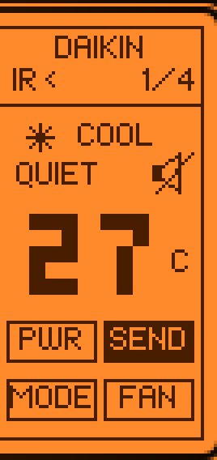
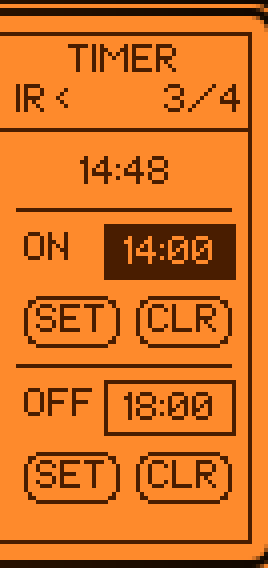
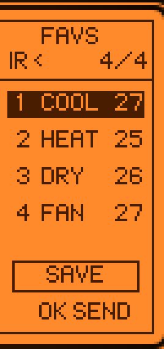

# Daikin64 AC Remote

Flipper Zero external app for sending dynamically generated Daikin64 HVAC IR frames.

## Features

- Daikin64 packet generation, not stored raw captures
- Power toggle, mode, temperature, fan speed, swing, sleep, quiet, turbo, and timer controls
- Favorite presets
- Last-used state and favorites saved to `/ext/apps_data/daikin64_ac_remote/state.bin`

## Screenshots

Screenshots captured from the app running on a connected Flipper Zero via qFlipper.

| Main | Functions |
|------|-----------|
|  |  |

| Timer | Favorites |
|-------|-----------|
|  |  |

## Layout

```text
applications_user/
    daikin64_ac_remote/
        application.fam
        daikin64_ac_remote.c
        hvac_daikin64_app_link.c

lib/
    hvac_daikin64/
        hvac_daikin64.c
        hvac_daikin64.h
```

`hvac_daikin64_app_link.c` includes the library implementation so `ufbt` builds it as part of the standalone FAP while keeping the reusable protocol code under `lib/hvac_daikin64`.

## Build

From the app directory:

```bash
cd applications_user/daikin64_ac_remote
ufbt build
```

If building from the workspace root with a full firmware tree, use the normal user-app flow for `applications_user/daikin64_ac_remote`.

## Protocol Notes

Daikin64 follows the IRremoteESP8266 `IRDaikin64` layout. The app returns packets in the same displayed byte order as decoded captures, for example `05 27 85 10 23 41 12 16`. Internally and on the IR carrier, Daikin64 sends the least-significant byte first and each byte least-significant bit first.

Checksum: the high nibble of the most-significant byte is the low 4 bits of the sum of every lower nibble in bits 0 through 59.

Mode encoding:

```text
Auto = 0xA
Cool = 0x2
Heat = 0x8
Dry  = 0x1
Fan  = 0x4
```

IRremoteESP8266 exposes Cool, Heat, Dry, and Fan in `IRDaikin64::setMode()`. Auto is included here because the APGS02 validation capture decodes as mode nibble `0xA`, matching the broader Daikin mode value used by other Daikin variants.

Fan encoding:

```text
Auto   = 0x1
Low    = 0x8
Medium = 0x4
High   = 0x2
Turbo  = 0x3
```

Temperature encoding: the byte is packed BCD Celsius, clamped to `16` through `30`. For example, `27 C` is `0x27`.

Swing encoding: vertical swing is bit 0 of the most-significant byte's low nibble. The fixed Daikin64 reserved bit 2 remains set. Power is bit 3 of that low nibble.

Power note: Daikin64 stores a power-toggle flag, not a persistent on/off state. Sending a packet with Power set toggles the indoor unit's power state.

Timings are ported from IRremoteESP8266 via the Daikin128 timing constants used by Daikin64:

```text
Carrier    38 kHz
Header     4600 mark, 2500 space
Bit mark   350
One space  954
Zero space 382
```

## Validation

The protocol test source in `tests/daikin64_vectors.c` checks packet generation and checksum verification against APGS02-style vectors.

The supplied captures contain changing clock/timer bytes and button-specific state. This implementation uses the captured APGS02 clock/timer baseline `16 xx 41 23 10 85 27 xx` and regenerates the checksum after changing power, mode, temperature, fan, and swing.

Before listing a Daikin indoor unit as compatible, use `TESTING_PROTOCOL.md` to record the model, original remote, app version, and pass/fail results for each function.

## Credits

- Daikin64 protocol behavior is based on the `IRDaikin64` implementation from [IRremoteESP8266](https://github.com/crankyoldgit/IRremoteESP8266), specifically `ir_Daikin.cpp` and `ir_Daikin.h`.
- App structure was initially informed by [flipperzero-mitsubishi-ac-remote](https://github.com/achistyakov/flipperzero-mitsubishi-ac-remote). The Mitsubishi protocol implementation is not reused.
- UI mockups and icon iteration used [Lopaka](https://lopaka.app/).
- APGS02 validation captures and on-device testing were performed with a Daikin APGS02 remote and a Flipper Zero.
- Development assistance was provided by OpenAI Codex.
